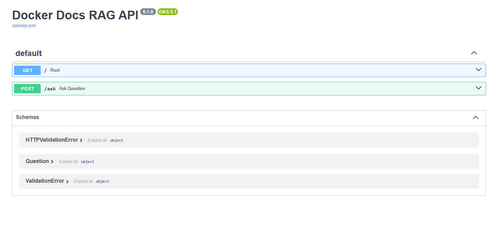
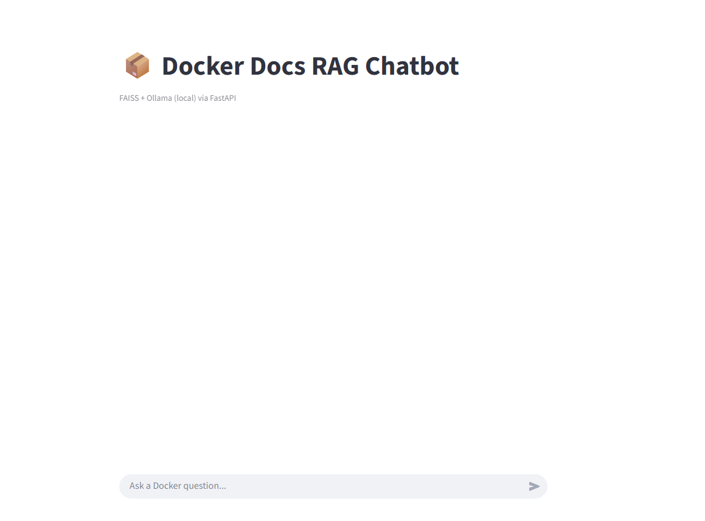
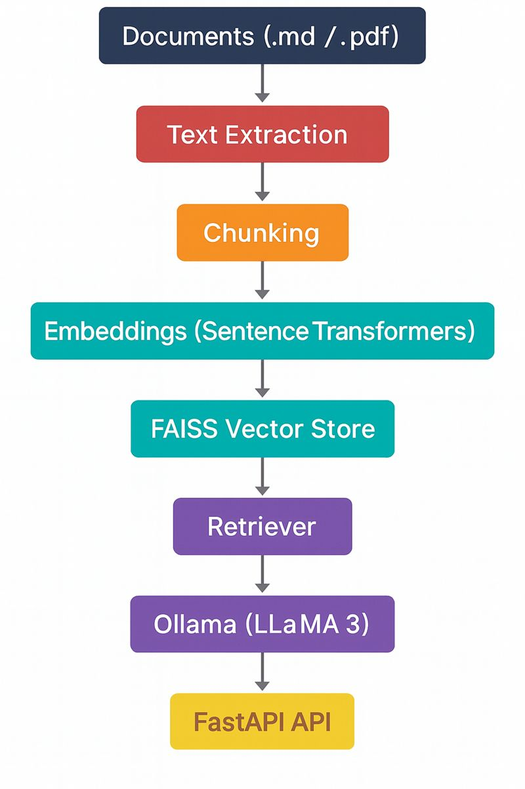

# 📦 Docker Docs RAG Chatbot

A production-style Retrieval-Augmented Generation (RAG) system that answers questions strictly from Docker documentation and security PDFs, with transparent source attribution.
Built with FastAPI, Streamlit, FAISS, Ollama, and Docker Compose, this project demonstrates end-to-end AI system design, from document ingestion to API + UI deployment. 
The system answers questions **strictly from provided documents**, with
transparent source attribution.
# 🚀 Why This Project Matters

# This repository is designed to showcase real-world AI engineering skills

✅ Document-grounded answers 

✅ API-first architecture

✅ Containerized deployment

✅ Local LLM inference (privacy-preserving)

✅ Recruiter-ready, production layout


## 🚀 Features

- 📄 Supports **Markdown (.md)** and **PDF** documents
- 🔍 Semantic search with **FAISS**
- 🧠 Local LLM inference using **Ollama (LLaMA 3)**
- 💬 Interactive **Streamlit chat UI**
- 🔎 Source citations for every answer
- 🔒 Fully local / private (no OpenAI or external APIs)


## 🧱 Architecture

### FastAPI Backend
<p align="center">
  
  <br/>
  <em>FastAPI service exposing document-grounded RAG inference</em>
</p>

### Streamlit UI
<p align="center">
  
  <br/>
  <em>Interactive chat UI for querying Docker documentation</em>
</p>

### RAG Pipeline
<p align="center">
  
  <br/>
  <em>End-to-end Retrieval-Augmented Generation workflow</em>
</p>

**Data Flow:** Documents → Chunking → Embeddings → FAISS → FastAPI → Streamlit

# Why this works (important)

api.png, streamlit.png, rag.png are in repo root

GitHub README automatically resolves relative paths

<p align="center"> keeps it clean and recruiter-friendly

Width keeps it readable on laptop & mobile


## 📁 Project Structure

```text
docker-docs-rag-chatbot/
├── data/
│   ├── raw_docs/                 # Markdown & PDF source documents
│   │   ├── docker_build.md
│   │   ├── docker_compose.md
│   │   ├── docker_engine.md
│   │   └── NIST.SP.800-190.pdf
│   │
│   ├── processed/                # Intermediate artifacts
│   │   └── chunks.json
│   │
│   └── vectorstore/faiss/        # FAISS vector index
│       ├── index.faiss
│       └── index.pkl
│
├── src/
│   ├── ingest.py                 # Extract text from docs
│   ├── embed_faiss.py            # Create embeddings + FAISS index
│   ├── rag_core.py               # RAG engine (retriever + LLM)
│   ├── api.py                    # FastAPI backend
│   └── streamlit_app.py          # Streamlit chat UI
│
├── Dockerfile.api                # FastAPI container
├── Dockerfile.streamlit          # Streamlit UI container
├── docker-compose.yml            # API + UI + Ollama orchestration
│
├── requirements.txt              # Python dependencies
├── README.md                     # Project documentation
└── LICENSE


## ⚙️ Setup

### 1️⃣ Create environment

```bash
conda create -n rag-chatbot python=3.10
conda activate rag-chatbot
pip install -r requirements.txt

# Install & start Ollama
data/raw_docs/
python src/ingest.py
python src/embed_faiss.py

# Run the Chatbot
streamlit run src/streamlit_app.py

# MIT License


✅ **Commit this first**  
This alone already makes your repo look serious.


# ✅ STEP 2 — Add FastAPI Backend

## 🚀 Deployment

Designed for production-style deployment on **AWS EC2** using Docker Compose.

- API (FastAPI) and UI (Streamlit) run as separate services
- Ollama runs locally inside a container for private LLM inference
- Services can be scaled independently

```bash
docker compose up --build
Access:

API Docs → http://localhost:8000/docs

Chat UI → http://localhost:8501


🔹 Install system deps
sudo apt update
sudo apt install -y python3-pip git


Install Ollama:

curl -fsSL https://ollama.com/install.sh | sh
ollama run llama3

🔹 Deploy project
git clone https://github.com/yourusername/rag-chatbot.git
cd rag-chatbot
pip install -r requirements.txt


Run API:

uvicorn src.api:app --host 0.0.0.0 --port 8000


Run Streamlit:

streamlit run src/streamlit_app.py --server.port 8501 --server.address 0.0.0.0
=======
# docker-docs-rag-chatbot
